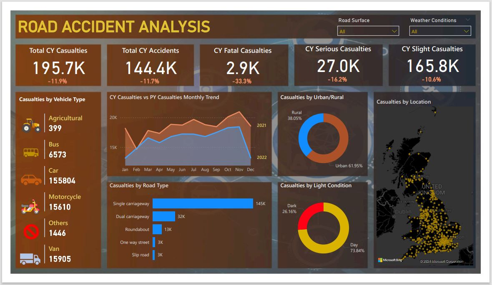

# STEPS TAKEN IN THE PROJECT

## Requirement Gathering

### Requirements

We want to create a road accident dashboard focused on year to have a better insight on the following:

- Primary KPI - total casualties and total accidents values for current year and YoY (year-on-year) growth
- Primary KPI - total casualties by accident severity for current year and YoY growth
- Seconday KPI - total casualties with respect to vehicle type for current year
- Monthly trend showing comparison of casualties for current year and previous year
- Casualties by road type for current year
- Current year casualties by area/location and by day/night
- Total casualties and total accidents by location

## Stakeholders in Project

Stakeholders are basically the users of the dashboard and those that have been identified to benefit from this dashboard include the following:

- Ministry of Transport
- Road Transport Department
- Police force
- Emergency Services Department
- Road Safety corps
- Transport Operators
- Traffic Management Agencies
- Public
- Media

## Raw Data Overview

Our datasource used for this project is an excel file ([click here to see](data-assets/Road-Accident-Data.xlsx)) which has 24 columns and 307,974 rows. The first thing to do is to check out our dataset and observe the data, by studying the data we can have an insight on what next to do. This is a rudiment in data analysis and cannot be put aside while building dashboard regardless on the tool of choice.

## Connecting Data with PowerBI

Power BI gives us many options when it comes to datasource and Excel happens to be one of the default connectors. To import our dataset into Power BI, we click on the the Import data from Excel option since our dataset is in Excel format, and then click on Load.

This will load our data, it can take a little time to load the dataset.

## Data Cleaning

After our dataset has been loaded, we clicked on the data view and check each of the columns to check for spelling mistakes, and other anomaly spelling mismatch, empty and null values.

On checking the columns, we were able to find a spelling mistake in the Accident Severity column, we do have **"Fatal"** and **"Fetal"**, obvious the "Fetal" was a misspelling of "Fatal", so we have to change all the rows of that column that has the value **"Fetal"** to **"Fatal"**.

We changed that by going the Report view >> then click on Home>> then click on Transform data, this will load the Power Query editor.

The reason for this is that we don't want to alter the original dataset file but altering the data that is already loaded in Power BI.

So, we click on the Accident Severity column, thereafter click on the Replace Values. Which will present us with a dialog box: Value to find and Replace With. We input "Fetal" in the "Value to find" and "Fatal" in the "Replace with" and click "OK".

After completing this process, we can click on the Accident Severity column again to check the values and see that "Fetal" is no longer an option.

## Data Processing

In our requirement we need to figure out the YoY casualties with respect to increase and decrease. One thing to take not of is that in any project that has a date field, it's of necessity to create a date table, and to do this we need to turn on our Time intelligence option on Power BI.

To do that go to File>> Options and settings>> Options>> See CURRENT FILE and click Data Load then select Time intelligence option (Auto data/time) and click OK.

Thereafter, we shall create the Calendar table. To do that, be in the Report view then Click Home>> Modeling>> New Table

Rename the new table with the following formula:

```DAX
Calendar = CALENDAR(MIN(Data[Accident Date]),MAX(Data[Accident Date]))
```

We want to extra the year and month from the date, so we create new columns by clicking on New Column and rename with the code below:

```DAX
Year = YEAR('Calendar'[Date])
Month = FORMAT('Calendar'[Date],'mmm')
```

## Data Modelling

After creating a new table with it columns, we need to connect it to our first table that has our dataset, to do this we need to create a relationship between the two tables.

We click on the Data view, there we can see out two tables, and we link Accident Date to our Calendar by dragging the Accident Date to the Calendar table. This creates a one-to-many relationship (that is a unique date on the calendar table can be linked to multiple date entries on the Data table).

Our requirements prompted us to create the Calendar table and we are not done yet, to actualise the first requirement, we will have to create a custom measure to determine the year to date.
To create a new measure, we shall right-click the Data table on the right pane and click on "New measure". We shall name our new measure CY (current year) Casualties. Below is the formular:

```DAX
CY Casualties = TOTALYTD(SUM(Data[Number_of_Casualties]),'Calendar'[Date])
```

## Background Design in Power Point

Our background design is designed in Microsoft PowerPoint and exported as a JPEG file, thereafter we import it into Power BI and put all the necessary elements on it from Power BI.


_Background Design for our Dashboard_

## Data Visualisation/ Charts Design

We need to mine our data to get more insight and fulfill our requirements, hence we shall be creating more measures to fully create our dashboard and they are as follows:

```DAX
PY Casualties = CALCULATE(SUM(Data[Number_of_Casualties]),SAMEPERIODLASTYEAR('Calendar'[Date]))

YoY Casualties = ([CY Casualties] - [PY Casualties])/ [PY Casualties]

CY Accidents Count = TOTALYTD(COUNT(Data[Accident_Index]), 'Calendar'[Data])

PY Accidents = CALCULATE(COUNT(Data[Accident Index]),SAMEPERIODLASTYEAR('Calendar'[Date]))

YoY Accidents = ([CY Accidents Counts]-[PY Accidents])/[PY Accidents]
```

Below is the overview of our dashboard after we completed our design.



_Overview of our Dashboard_

click [here](/road-accident-analysis_power_bi.pdf/) for a pdf export of the dashboard design.

## Insights

We can deduce the following from our analysis:

- Vehicle type with the highest number of casualties and accidents is the car
- Single carriageway has the highest number of casualties and accidents by Road Type
- There are more casualties and accidents in the day than in the dark
- Dry road surface and fine weather condition has the highest number of casualties and accidents
- There are more accidents and casualties in urban areas than rural areas.

In otherword, accidents and casualties happens more with a car on a dry single carriageway road in urban areas during the day time and fine weather. Even though there is a decline from 2021 to 2022, there is still a monthly upward trend noticed in the year 2022.

[Click here](data-assets/road-accident-analysis_power_bi.pbix) to get the Power BI file of the dashboard.

<video src='visual-data/demo-video.mp4' width=640 />

Click to play the video of the demo
